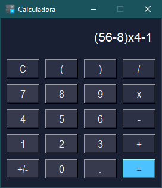

# Calculadora Simple

### Mi primer proyecto en python:

- Calculadora de interfaz grafica sencilla
- Utilizar el paquete tkinter
- Un diseño sencillo pero elegante de colores oscuros
- Utilizar unicamente librerias propias de Python

  

